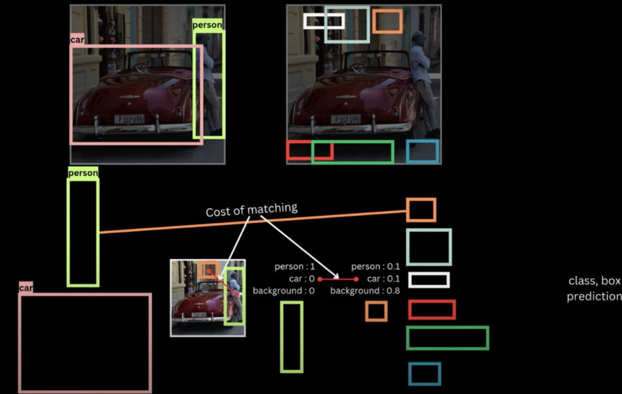

#### Basic Overview

- Understanding all the components of DETR model

- Understanding the `loss` that DETR uses
  - For thijs we need to understand `The Hungarian Matching Algorithm`
  - 
 - In part 2, we will move to DETR model and implementing on `VOC` dataset
    - Looking at results
    - What different attention maps look like 

#### What does our model input and output look like?
- Input as an image is fed to the Detector model
- It spits out `class predictions` and `confidence scores`

##### All components story

- We first have a pretrained backbone like Resnet50 trainined on `Imagenet` data and feed the image.
- We remove the `pooling` and `classification` layers to get the `semantic` information of the various regions of the image.
- Similar to ViT, we patchify the feature map obtained from backbone and feed this to the Encoder. Each patch serves as an image token (`usual concept`)
- The Encoder then spits out contextualised token.
- On the side of the `Decoder`, we feed `N Object Queries` which are randomly initialised `N Embeddings`.
- The Decoder learns these `N Obect queries` during traininng to make predictions.
- The Decoder attends the output of the Encoder (using a `cross attention` layer), inorder to output `N` output predictions.
- The output of the Decoder is then fed to `class MLP` and `box MLP` to get `class prediction` and `confidence scores`.

> [!NOTE]
> - (As many objects as there are queries) There is a one-one correspondence between each contextualised image token and (bbox with class_pred + conf)
> - In the above image, therre are 6 `predictions` for 6 `Object queries`.
> - say one prediction is (car, 0.8 conf) other (person, 0.9 conf).
> - The others will simply be predictions for `background class` with `conf`.
> - Reemember as many `object predictions` as `object queries`.

##### Assigning Targets to predictions

##### What did nms solve; Change here in DETR

> - asdas
> - asdasd
> - lkjkl
> 

##### A set prediction problem (DETR)

In contrast to `anchor based models`, where the predictions are duplicate i.e multiple preds for a given target, the `transformer based` models learn so that output preds and targets are 1-1.
- The model is forcxed to learn this over time. (Hence, no need for `nms`)
> [!IMPORTANT]
> - Recall for anchor based, when multiple boxes for same targets are predicted, we suppress the non-maximal ones (`nms` strategy)

##### Unique assignnment + lowest matching cost

> [!NOTE]
> - By unique assignments; we mean 1-1 bijection between each `gt_box` and `pred_box`
> - If more than `gt_boxes` are predicted, then the rest will be mapped to `bg`
> - And, among all the valid `set predictions` or `matchings`, we want the `minimum cost` one.

##### Cost of matching

##### Valid / Invalid assignments

> [!NOTE]
> - Invalid assignment as shown on the `top-right`, one gt is mapped to multiple `preds`
> - This is invalid.