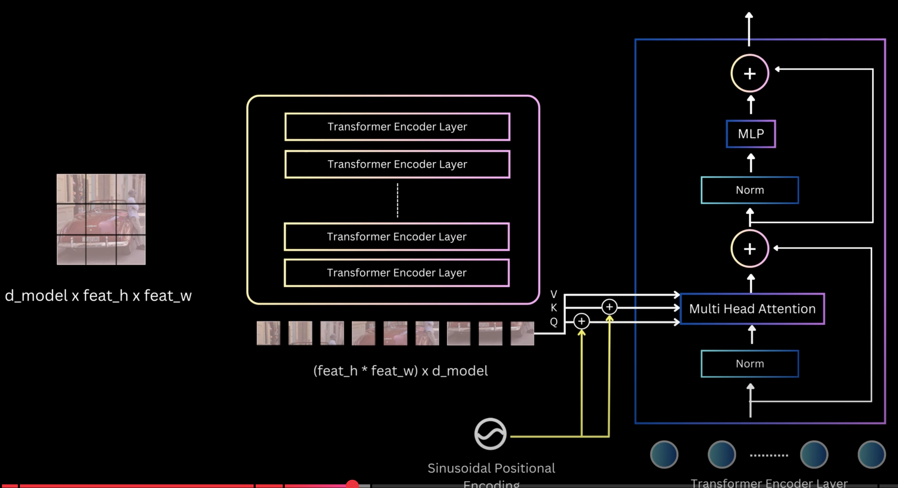
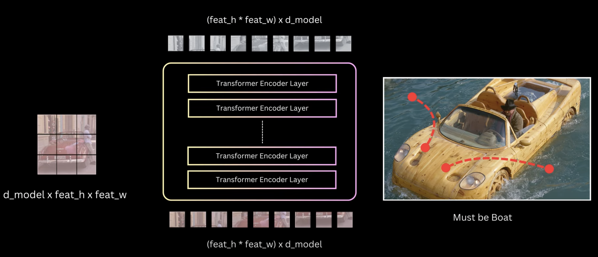

#### Component 1 (Encoder)

- We now have (`feat_h x feat_w x C`) shape of feature map from backbone.
- The transformer encoder expects it to be in the dimension `d_model x feat_h x feat_w` which is done by the `linear projector.
- This is input to the Encoder
- The Encoer as shown is `Nx` of these `Transformer Encoder Layers`
- If we unpack, one of these layers, we get `input -> norm -> MHA -> skip -> norm -> MLP -> skip`
- Generally, tyhe positional info is `injected` into the input tensor, nut here it's a bit diff.
- Here, at every `MHA`, they inject the `positional relationship` between any 2 tokens. (`recall: 2d_patchify function`).

> [!IMPORTANT]
- But, catch is `V` is never used in positional info. Only `K and Q`
- The authors, experimented with both the approaches, and found adding at every `MHA` layer the results were better.

#### MHA bakes in Contextual Info

- The output of the `Encoder` layer is same as the input. (feat_h x feat_w x d_model)
- But, the output is `contextual relationship` between different pixels of the image.
- If 2 arbitrary pixels belong to the `same` object, the `MHA` layer now, establishes a `relationship` between them, which is learnt as the model trains rather than relying on the `features` of the object
- This helps in detecting ambigous and `hard-to-detect` cases
