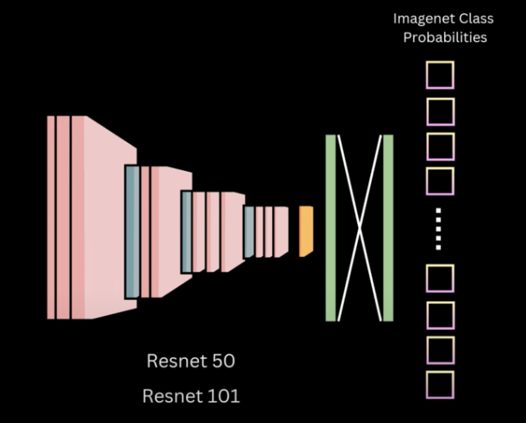
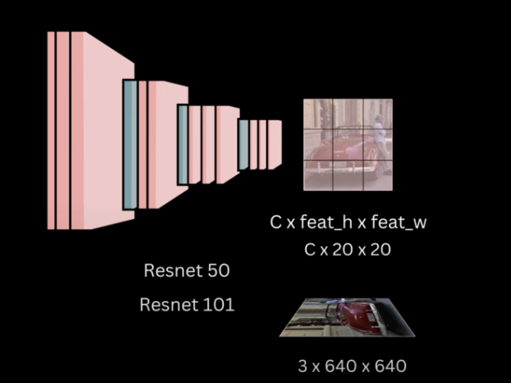
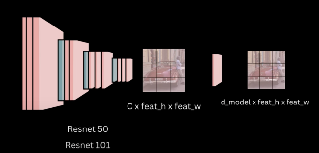

#### Backbone choices

- `Resnet50` or `Resnet101` are mostly used as choices for the backbone for `DETR`.
- These are pretrained i.e weights are frozen.
- Trained on `ImageNet` classification task
- As shown below, these networks have multiple layers of `Conv2d`, `skip connections`, finally ending up in a `feature extractor`, then a `pooling` layer followed by a `classifier head`
- When we use in `DETR` as a backbone, we remove the last `pooling` and `classifier head`, and simply use the `feature extractor`
- 

#### Need for a projection layer

- The backbone output feat_map shape is:  `C x 20 x 20`
- The original image is of shape: `3 x 640 x 640` and the overall stride of Resnet is `32` => Hence, the `feat_h = feat_w = 20`

- But, the transformer expects a dimension of `d_model`. Hence, we need a `linear projector` that transforms the dim from `C` to `d_model` keeping the `H and W` of feat_map same
- Hence, the authors use `1 x 1` conv layer
- Finally, we arrive at `d_model x feat_h x feat_w`